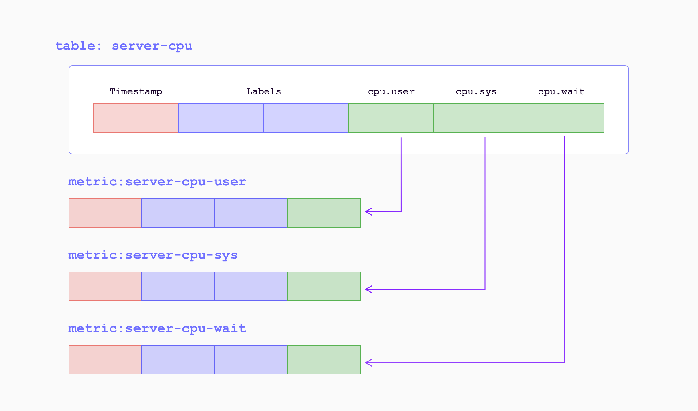
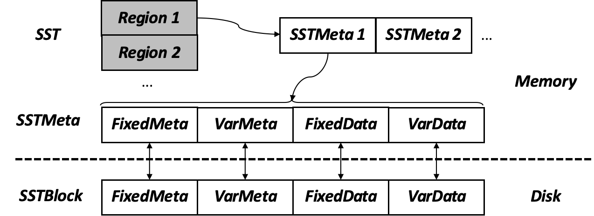

# 数据节点——阶段一

## 目标
* 单机实现数据节点，包括如下两个功能
	* 多线程、多区域向磁盘写入时间序列数据，数据分片与区域一一对应
	* 在运行时对区域的生命周期进行控制，包括区域的创建、打开、关闭和删除
* 暂不考虑以下功能
	* 多个逻辑分区复用同一物理分片（即MetricEngine）
	* 区域宕机复原（即WAL，阶段二考虑）
	* 区域彻底删除及区域数据删除（阶段二考虑）
	* 区域调度（MetaSrv而非数据节点需要考虑的内容）
	* 查询与数据读出（不进行标准实现，仅进行写入的简单验证）
	* 数据压缩、索引建立（即compactor和index，阶段三考虑）

## 主要组件
### RegionServer
* 功能
	* 接收写入请求
	* 将请求处理为区域粒度的请求
	* 判断区域是否在该数据节点并路由到对应引擎（当前仅Mito引擎）
* 请求输入格式（json格式字典）
	* type: string（请求类型，包括WRITE和ADMIN）
	* regionID：long（区域编号）
	* operation: string （ADMIN类型专属，包括CREATE、OPEN、CLOSE、DROP）
	* regionName：string（ADMIN类型、CREATE操作专属，区域名）
	* expr：string（ADMIN类型、CREATE操作专属，区域表达式）
	* attrs：string（ADMIN类型、CREATE操作专属，区域参数列表json）
	* timestamp：long（WRITE类型专属，写入操作发生时间）
	* jsonData：string（WRITE类型专属，写入数据）
* 类：RegionServer
	* 成员
		* regionMap：哈希表，记录当前数据节点区域-引擎对应关系
		* enginePipes：读写环队列，作为与引擎的请求通信管道
	* 成员函数（类构造、类析构、线程运行、线程停止函数省略）
		* string getRequest()：接收写入请求（管道或控制台输入）并解析
		* long searchRegion(string request)：查找请求对应的区域，失败（区域不存在于该节点或未建立完成）返回long最大值
		* void sendRegionRequest(string request, long regionID)：通过管道发送区域粒度请求
		* void handleFailure(string request)：处理失败请求

### MitoEngine
* 功能
	* 接收该数据节点的区域写入请求和区域生命周期管理请求
	* 将区域粒度请求映射到对应的Worker线程
* 类：MitoEngine
	* 成员
		* workerMap：哈希表，记录当前区域-工作线程对应关系
		* serverPipe：读写环，作为与区域服务器的请求通信管道
		* workerPipes：读写环队列，作为与工作线程一一对应的管道
	* 成员函数
		* long regionIDToWorkerID：计算区域与工作线程的固定映射关系
		* <string, long> getRegionRequest()：从管道中获得区域粒度请求
		* string getRegionStatusRequest()：接收区域生命周期管理请求（管道或控制台输入）并解析
		* void sendRegionRequest(string request, long regionID)：通过对应管道发送区域粒度请求到工作线程

### RegionWorker
* 功能
	* 执行区域生命周期管理操作
	* 将数据写入memtable
	* 检查memtable使用情况，当写满时更新并提交刷新请求
* 类：RegionWorker
	* 成员
		* enginePipes：读写环队列，作为与引擎的请求通信管道
		* regions：哈希表，该工作线程管理的区域的ID-上下文映射信息（一个区域只会被一个工作线程管理，因此由工作线程私有的哈希表只会被一个线程修改；相反地，如果使用一个公共的区域哈希表存储区域上下文，则会同时被多个工作线程修改）
		* flusherPipe：读写环，作为与Flusher的通信管道
	* 成员函数
		* <string, long> getRegionRequest()：从管道中获得区域粒度写入请求或生命周期管理请求
		* void handleWrite(string request, long regionID)：处理区域写入请求
		* void handleStatus(string request, long regionID)：处理区域生命周期改变请求
		* bool checkUsage(long region)：检查区域memtable使用情况
		* void sendFlushSignal(Memtabel\* memtabel, SST\* sst)：提交刷新请求

### Flusher
* 功能
	* 执行刷新操作，将memtable修改为SST格式写入磁盘
* 类：Flusher
	* 成员
		* WorkerPipe：读写环，作为与工作线程的通信通道
	* 成员函数
		* <Memtabel\*, SST\*> getSignal()：从管道中获得刷新信号
		* void handleFlush(Memtabel\* memtabel, SST\* sst)：处理磁盘写入操作

### DataNode
* 功能
	* 数据节点管理器，用于构造、运行、停止、释放其余组件
* 类：DataNode
	* 成员
		* components：组件上下文，包括1个RegionServer、1个MitoEngine、若干RegionWorker和1个Flusher
		* threads：组件线程，与组件上下文一一对应，通过组件内实现的线程运行函数（run）运行
	* 成员函数
		* init(string attrs)：初始化组件上下文
		* run()：创建组件线程，调用组件内的线程运行函数，运行组件
		* stop()：调用组件内的线程停止函数，停止组件，清理组件线程
		* clean()：清理组件上下文

## 主要数据结构
### PipeRing
* 无锁读写环，用于线程之间通信（已实现）

### MemTable

* 区域内存写入结构，实现列式存储的内存区域表缓存
* 子类
	* Value：数值`using Value = std::variant<int64_t, double>;`
	* Row：数据行结构
		* u_int64_t timestamp：时间戳
		* std::vector<Value>：值向量
	* ~~Column：数据列结构，本质为一个Value向量~~
	* ~~ColumnarSeries：时间列，时间戳（隐式主键）+Column向量~~
		* ~~std::vector<int64_t> timestamps~~
		* ~~std::unordered_map<std::string, Column> columns~~
	* ~~KeyField：复合主键~~
		* ~~std::string name;~~
		* ~~Value value;~~
	* ~~KeySeries：复合主键~~
		* ~~std::vector<KeyField> fields~~
		* ~~重写哈希函数~~
* 成员
	* bool mut：是否可修改
	* capacity：容量
	* vector<Row> rows：数据
	* vector<string> names：列名
* 成员函数
	* void write(const KeySeries& key, int64_t ts, const std::unordered_map<std::string, Value>& fields)：写入函数
	* long capicity()：返回当前memtable内存使用量
	* void freeze()：冻结该memtable，使其不可修改
	* const std::unordered_map\<KeySeries, ColumnarSeries, KeySeriesHash\>& tabel()：获取只读的table，用于刷新

### MemoryBuffer
* 内存分配与回收结构，可保证数据节点可以控制memtable的内存申请总量和内存的连续性（已实现）
* 可以直接使用操作系统代替

### Region
* 区域上下文，包括id、名称、分区逻辑、memtable指针、SST位置指针

### SST

* 磁盘存储结构，Sorted String Table
	* 不在SST中区分主键与数据
	* 暂不考虑压缩
* 子类
	* BlockFixedMeta：用于存储块定长元数据
		* long block_size：块总大小
		* long fixed\_meta\_size：定长元数据块大小
		* long var\_meta\_size：变长元数据块大小
		* long fixed\_block\_size：定长数据块大小
		* long var\_block\_size：变长数据块大小
		* long row_num：行数
		* long column_num：列数（包括时间戳列）
	* BlockVarMeta：用于存储块变长元数据
		* long* column_size：列数值长度（包括定长值和变长值）
		* long* column\_name\_offsets：列名偏移量（列名数+1，最后一个值表示尾部）
		* char* column_names：列名
	* FixedBlock：用于存储定长数据和变长数据在变长数据块中偏移量和长度的数据块
		* char* rows：行
		* 成员函数：
			* void write(rowID, rowSize, colID, colSize, char* data)
			* char* read(rowID, rowSize, colID, colSize）
	* VarBlock：用于集中存储变长数据的数据块
		* char* buffer
		* 成员函数：
			* void write(char* data, size, pos）
			* char* read(pos)
	* SSTBlock：SST块在内存中的形态：
		* char* data：完整的SST数据，该块
		* BlockFixedMeta*
		* BlockVarMeta
		* FixedBlock
		* VarBlock
	* SSTBlockMeta：记录一个SST块（对应一个MemTabel）的上下文，存储在内存中
		* filepath：文件路径
		* filename：文件名
		* offset：偏移量
		* patition_exp：对应的分区表达式
		* start_time：block开始时间
		* end_time：block结束时间
		* SSTBlock* block：内存缓存的block位置，如果不在内存中为空
* 成员
	* vector<SSTBlockMeta> metas：SSTBlock的向量
	* LogPath：记录SSTBlockMeta的文件，避免断电丢失
* 成员函数
	* SSTBlock flush(MemTable &)：写入MemTabel到磁盘，返回其上下文

### DataNodeComponent
* 组件基类，所有数据节点组件类均继承该类，便于组件生成与释放
* 成员
	* string name：组件名称，便于管理组件
	* atomic_bool running：用于异步停止线程的信号变量
* 成员函数
	* 构造函数
	* 析构函数
	* void run()：线程运行函数
	* void stop()：线程停止函数

